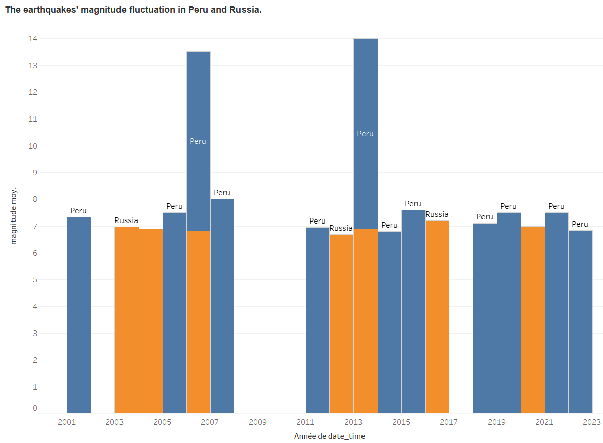

Welcome to My Data Science Portfolio!  

[**SQL Database Query Project**](https://drive.google.com/file/d/1XDWDBR2VBBg52PwUxV2YZ2158zH3hAny/view?usp=sharing)

• Designed and queried a relational database that includes tables for Products, Customers, Orders, OrderDetails, and ProductTypes.

• Extracted valuable insights, such as identifying customers with the highest number of orders, most frequently ordered products, and customer orders by specific days.

• Utilized SQL functions like GROUP BY, JOIN, ORDER BY, and the TOP clause for optimized result retrieval in SQL Server.

• Key highlights:

   -Created a database schema with proper primary and foreign key relationships.

   -Formulated complex queries to analyze customer and product order data.

   -Optimized queries for efficient data retrieval using SQL Server features.

**Business Impact:** This project provides insights that help businesses optimize inventory and order management. By identifying top customers, most ordered products, and peak order times, companies can tailor marketing efforts, streamline supply chain operations, and boost sales.

[**SQL Project: Relational Database Management**](https://drive.google.com/file/d/1IHJJ2A6gym034ZEWMPtVbBhRi04oVZd1/view?usp=sharing)

• Implemented an entity-relationship model for a wine producer system using SQL. 

• Converted the conceptual diagram into a relational model.

• Created tables for wines and producers.

• Inserted data.

• Performed various SQL queries including retrieving and sorting producers, calculating total and average production and identifying producers and their wine quantities.

**Business Impact:** The system could assist a wine producer in tracking production, managing inventory, and forecasting demand. Efficient data management enables better decision-making for inventory control and sales strategies.

[**Python Project: Web Scraping**](https://colab.research.google.com/drive/10vHBz1i-J7uscc0I2jJU_2S7EA_-lWOo?usp=sharing)

• Developed a Python tool using **BeautifulSoup** and **Requests** to extract structured data from Wikipedia pages. 

• Retrieved the article title, maps headings to paragraphs, and collected internal Wikipedia links. 

• Combined all functionalities into a single reusable function. 

• Tested on two different Wikipedia pages.

**Business Impact:** Automating data collection from websites can save businesses time and reduce manual effort. This tool can be used to monitor competitor content, gather market research, or analyze trends, improving strategic planning and responsiveness to market changes.

[**Python Project: Data visualization**](https://colab.research.google.com/drive/1pwZAB9R3HINIg3WCDcza7XJrJ0oBWfxX?usp=sharing)

• Analyzed climate change data for five African countries (Egypt, Tunisia, Cameroon, Senegal, Angola) from 1980 to 2023, provided by the U.S. Global Change Research Program.

• Cleaned and processed the dataset to ensure accurate and meaningful analysis.

• Built visualizations including line charts to illustrate temperature fluctuations in Tunisia and Cameroon, and histograms to compare temperature distributions in Senegal before and after 2000.

• Created summary charts to display the average temperature per country, identified the top three hottest countries by average temperature, and designed a map chart to visualize these insights.

**Business Impact:** Understanding climate change data can help businesses in agriculture, energy, and policy-making adjust their strategies to mitigate risks associated with changing weather patterns. Insights into temperature trends support data-driven environmental decision-making.

[**Tableau Project 1: Data Visualization Dashboard**](https://public.tableau.com/views/TableauProject_17321202750010/Dashboard1?:language=en-US&:sid=&:display_count=n&:origin=viz_share_link)

• Created a Tableau dashboard using the Accelerator Program Data Set from Massachusetts to help visualize and analyze key metrics such as sales, profit, quantity, and trends over time. 

• Built visualizations, including column, bar, line, and pie charts, to provide clear insights into the data. 

• All visualizations were combined into one interactive dashboard for a comprehensive view of the dataset.

**Business Impact:** This dashboard provides a clear visual analysis of key sales and profitability metrics, enabling businesses to identify trends, improve product offerings, and enhance profitability. The interactivity allows for deep dives into specific periods or product categories for more granular analysis.

[**Tableau Project 2: Data Visualization Dashboard-earthquakes records between 1/1/2001 and 1/1/2023 worldwide**](https://public.tableau.com/views/DataVisualizationWithTableauSoftware_17321357470830/Dashboard1?:language=en-US&:sid=&:redirect=auth&:display_count=n&:origin=viz_share_link)

• Created a Tableau dashboard using global earthquake data to analyze and visualize key metrics such as magnitude, significance, and tsunami occurrences.

• Built visualizations, including pie charts, map charts, and custom graphs, to explore relationships and trends such as magnitude distribution, significance levels, and yearly fluctuations.

• Combined all visualizations into an interactive dashboard to provide a comprehensive view of global earthquake patterns, published on Tableau Public.

**Business Impact:** This dashboard helps governments, NGOs, and insurance companies assess earthquake risks. By understanding patterns in earthquake magnitude and significance, stakeholders can make informed decisions on disaster preparedness and risk management.

